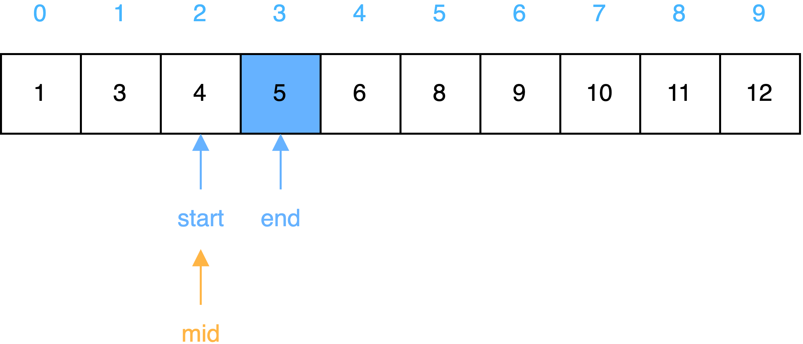
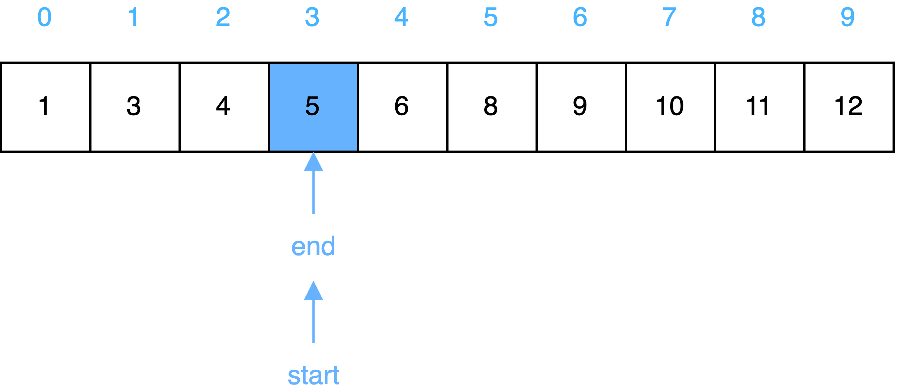
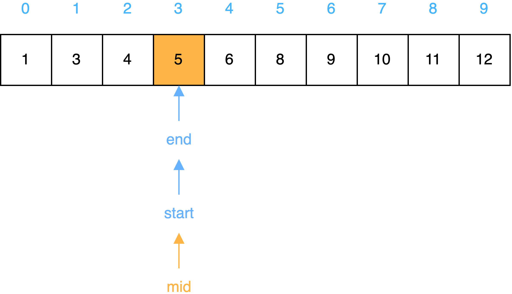
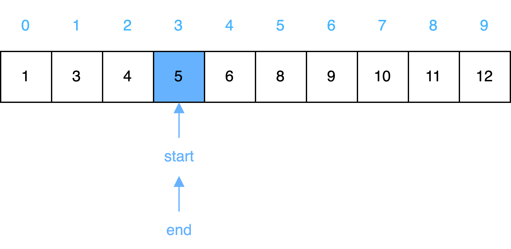

## Basic binary search

The [binary search](https://en.wikipedia.org/wiki/Binary_search_algorithm) it's a **search algorithm** which find the index of a particular value which is stored in a **sorted** array.

- [Random access](https://en.wikipedia.org/wiki/Random_access) is a requirement for performing this search.

The binary search classical formalization is the following:

```python
def binary_search(nums: List[int], target: int) -> int:
    start, end = 0, len(nums) - 1

    while start <= end:
        mid = start + (end - start) // 2

        if nums[mid] == target:
            return mid
        elif nums[mid] < target:
            start = mid + 1
        else:
            end = mid - 1

    return -1
```

It is the most intuitive way of understanding the behaviour of this algorithm, let's walk through the iterations.

### First loop

Initial variables:

- `nums = [1, 3, 4, 5, 6, 8, 9, 10, 11, 12]`
- `target = 5`
- `start = 0, end = 9`
Algorithm steps:

1. The mid index get computed as `mid = 0 + 9 / 2 = 4`, this is a bad case, because the `target` is one position away from the `mid`.


2. Test `target` against mid value:
   1. Is `target` equal to mid value? No (`5 != 6`)
   2. Is `target` smaller than mid value? Yes (`5 < 6`), let's continue the search on the left side of the mid element (`end = mid - 1`).


### Second loop

1. The mid index get computed as `mid = 0 + 3 / 2 = 1`


2. Test `target` against mid value:
   1. Is `target` equal to mid value? No (`5 != 3`)
   2. Is `target` smaller than mid value? No (`5 > 3`)
   3. Is `target` bigger than mid value? Yes, let's continue the search on the right side of the mid element (`start = mid + 1`).


### Third loop

1. The mid index get computed as `mid = 2 + 3 / 2 = 2`



1. Test `target` against mid value:
   1. Is `target` equal to mid value? No (`5 != 4`)
   2. Is `target` smaller than mid value? No (`5 > 4`)
   3. Is `target` bigger than mid value? Yes, let's continue the search on the right side of the mid element (`start = mid + 1`).



### Fourth loop

1. The mid index get computed as `mid = 3 + 3 / 2 = 3`



2. Test `target` against mid value:
   1. Is `target` equal to mid value? Yes (`5 == 5`), the `mid` index is returned.

Although the conceptual idea of binary search is comparatively straightforward, the details can be tricky.

The real pit of binary search is not the integer overflow, but the whether to add one to or subtract one from `mid`, and where to use `<=` or `<` in the loop condition.

## Flaws of the basic algorithm

This algorithm is great and simple, but has some limitations. In some specific problems, some target number could be repeated along the array, and the problem requiremnt could be the left border or right border of this sequence.

**The current algorithm can't handle this issue.**

- Adding a **linear search** to the found sequence will compromise the complexity in time of the binary search.

## Generalized framework

The following generalized framework **searches for the minimum index which satisfies the `condition(...)` function.**

- More formally, "minimize k such that satisfies the condition(k)".

```python
def binary_search(array) -> int:
    def condition(value) -> bool:
        pass

    start, end = min(search_space), max(search_space)

    while start < end:
        mid = start + (end - start) // 2
        if condition(mid):
            end = mid       # Inclusive reduction of the right boundary
        else:
            start = mid + 1 # Exclusive reduction of the left boundary
    return start
```

**After the execution of the loop, `start` variable will contain the minimum index (left-most) satisfying the inner `condition` function.**

We should care about three parts of this template:

- Initialisation of the boundary variables `start` and `end` to specify the **search space** (all the possible elements).
- Decide return value.
- Design the `condition` function, this is the hardest part.

Let's see the basic search with the generalized framework:

```python
def binary_search(nums: List[int], target: int) -> int:
    start, end = 0, len(nums) - 1

    while start < end:
        mid = start + (end - start) // 2
        if nums[mid] >= target:
            end = mid
        else:
            start = mid + 1
    return start
```

This looks a bit less readable than the classical algorithm, but understanding the mechanics behind this will allow to gneeralize the binar search to many more coding problems.

*Why are we using `>=` in the **condition function**?*

Think in this way, we are **searching for the minimum k for which `nums[mid] >= target`**, we are searching the value (index) that satisfies the condition. If we would use `>` instead of `>=` we would get the index k which is greater (and not equal) than `target`.

Considering the following example with just two elements of an array, if we apply the **condition function** with `>`, it would trigger the expression in the `else` branch, which will set `start` to `mid + 1`.


This would stop the loop (`start == end`), but now `start` (**k**) is the index of an element greater than `target`.


*What return condition should I use if the element is not in the list?*

That's a nice question, and it should be specified from the problem itself, the previous code was assuming that the element was always present. If the `target` can miss, a common requirement is to return `-1`, which can be easily written in the return condition:

```python
    return start if nums[start] == target else -1
```

### 1st loop

Initial variables:

- `nums = [1, 3, 4, 5, 6, 8, 9, 10, 11, 12]`
- `target = 5`
- `start = 0, end = 9`

Algorithm steps:

1. `mid = 4`


2. Test the **condition function** `nums[mid] >= target`:
   1. Is `nums[mid] >= target`? Yes (`6 > 5`), reduce the **search space** from the right (`mid` excluded).


### 2nd loop

1. `mid = 2`


2. Test the **condition function** `nums[mid] >= target`:
   1. Is `nums[mid] >= target`? No (`4 < 5`)
   2. Then `nums[mid] < target`, reduce the **search space** from the left (`mid` included).


### 3rd loop

1. `mid = 3`


2. Test the **condition function** `nums[mid] >= target`:
   1. Is `nums[mid] >= target`? Yes (`5 == 5`), reduce the **search space** from the right (`mid` excluded).



The next loop condition check will be evaluated as `False` since `start == end == 3`

### Variant: maximizing the index which satisfied the condition

We would like to achieve the opposite behaviour, we would like to maximize so that the algorithm execution would take the right-most index of the array.

For doing that, we have to:

- Invert the **comparison condition**.
- Using a [right mid](#left-and-right-mid), this ensure that in the case of two elements the algorithm will consider the rightest.

```python
def binary_search_max(nums: List[int], target: int) -> int:
    start, end = 0, len(nums) - 1

    while start < end:
        mid = start + (end - start + 1) // 2
        if nums[mid] <= target:
            start = mid
        else:
            end = mid - 1
    return start if nums[start] == target else -1
```

Let's consider the following algorithm execution with an undefined value of `target`:

```python
 0  1  2  3  4  5  6  7  8
[1, 2, 2, 2, 3, 4, 5, 6, 7]
 ^                       ^
start                   end

 0  1  2  3  4  5  6  7  8
[1, 2, 2, 2, 3, 4, 5, 6, 7]
 ^           ^           ^
start                   end
            mid

 0  1  2  3  4  5  6  7  8
[1, 2, 2, 2, 3, 4, 5, 6, 7]
 ^        ^
start    end

 0  1  2  3  4  5  6  7  8
[1, 2, 2, 2, 3, 4, 5, 6, 7]
 ^     ^  ^
start    end
      mid

 0  1  2  3  4  5  6  7  8
[1, 2, 2, 2, 3, 4, 5, 6, 7]
       ^  ^
         end
     start

 0  1  2  3  4  5  6  7  8
[1, 2, 2, 2, 3, 4, 5, 6, 7]
       ^  ^
         end
         mid
     start

 0  1  2  3  4  5  6  7  8
[1, 2, 2, 2, 3, 4, 5, 6, 7]
          ^
         end
         start
```

## Application of the generalized framework

### `sqrt(target)`

Searching for the minimal k satisfying `k^2 > target` condition, then the answer is `k - 1`.

- The loop will terminate with `start == end`, in the last iteration if **inner condition function**
is satisfied, the `start` variable will contain **the minimal `k` for which `mid * mid > target`**, this means that the answer is `start - 1`

```python
def my_sqrt(x: int) -> int:
    start, end = 0, x

    while start < end:
        mid = start + (end - start) // 2

        if mid * mid > x:
            end = mid
        else:
            start = mid + 1

    return start - 1
```

It is also possible to use as return value the `mid` index if declared outside the loop cycle, the code will behave in the same way for perfect squares, while it will approximate by *excess* non-square inputs (the code will approximate by *default*).

### Search Insert Position

Searching for the **minimal k value satisfying `nums[k] >= target`**, if the element is not present we want to return the index of where the element should be placed.

We already have the solution for this problem, the [basic implementation](#generalized-framework) of the generalized framework.

The only issue is in the **search space**, if we consider the edge case in which the element isn't present and it is greater than the last one contained in the array, than we need an index (**k**) pointing outside that array. This translates in increasing the **search space** by 1, so `end = len(nums)`.

```python
def binary_search_insert(nums: List[int], target: int) -> int:
    start, end = 0, len(nums)

    while start < end:
        mid = start + (end - start) // 2
        if nums[mid] > target:
            end = mid
        else:
            start = mid + 1
    return start
```

## Advanced applications

### When to use binary search?

Sometimes we don't even realize that the problem should be solved with **binary search**, how we can understand if the **binary search** can be used?

> **If we discover some kind of [monotonicity](https://en.wikipedia.org/wiki/Monotonic_function), then we can consider binary search.**

For example if `condition(k)` is `True` then `condition(k+1)` is `True`.

### Other problems

TODO: Adding Medium/Hard problem explanations from zhjijun_lao post

## Why `<` instead of `<=` in the loop condition?

Because the initial assignment of `end` is `len(nums) - 1`, which is the index of the last element, and not `len(nums)` (which contains an extra *immaginary* element).

- The first approach has a **search space** of `[start, end)`
- The second approach has a **search space** of `[start, end]`

Termination conditions:

- For `start < end` is `start == end`, when they are both on the same element.
- For `start <= end` is `start == end + 1`, when the `start` index surpass by 1 element the `end` index.

### Search space boundary

Normally we can see this kind of boundary initialization:

```python
    start = 0
    end = len(nums) - 1
```

But this is not always the case.

> The boundary is the range of elements we will be searching from. The initial boudnary should include all the elmeents, meaning all the possible answers should be included.

For example, in [LeetCode #35](https://leetcode.com/problems/search-insert-position/description/) if the `target` isn't found we have to return the the index of where the element could be, and this could be even after the last element.

This means that the search space will be bigger:

```python
    start = 0
    end = len(nums)
```

### Calculating `mid`

When the number are extremely big it can result in an [**integer overflow**](https://en.wikipedia.org/wiki/Integer_overflow).

There are three ways of computing the `mid` index, from the worst to the best.

#### First approach

> `mid = (start + end) / 2`

This is the most readable approach, but the risk of incurring in **integer overflow** (going beyond the representation limits for integers) is high with bigger values of `start` and `end`.

### Second approach

> `mid = start + (end - start) // 2`

This approach is a refinement of the first, subtracting `start` from `end` reduces the amount of numbers involved in the sum.

### Third approach

> `mid = (start + end) >> 1`

The **right shift** bitwise operator doesn't introduce new bits in the representation of a number, this means that can't cause an overflow on big numbers.

## Left and right mid

When we are dealing with an **even** number of elements, it is our choice to pick the **left mid** or the **right mid**

Left mid (**integer division** prefer the left side of the array):
> `mid = start + (end - start) // 2`

Right mid:
> `mid = start + (end - start + 1) // 2`

## Infinity loop

A bad choice of [left and right mid](#left-and-right-mid) will lead to **infinity loop**.

**The choice of `mid` and our comparison logic has to work together in a way that every time, at least 1 element is excluded.**

Let's consider the base case when we have only two elements (which is like having *even* number of elements in the input), and how
two misplaced mid will lead to infinite loop.

### Wrong left mid

```python
if nums[mid] > target:
    start = mid - 1
else
    end = mid
```

Using this logic with the **left mid**, in the case the execution will reach the `else` (this means that the `target` isn't the element pointed from `mid`), it will just keep "update" the `mid` element to the same value of `start`, and this will stuck the program for ever.

In this case we had to use the **right mid** instead `mid = start + (end - start + 1) // 2`


### Wrong right mid

```python
if nums[mid] < target:
    end = mid + 1
else
    start = mid
```

The same happens simmetrically with the **right mid**, the fix will be using the **left mid** `mid = start + (end - start) // 2`


## Complexity

Time complexity is O(log2 n), while space complexity is O(1).

## Resources

These notes are heavily based on multiple articles I found on Leetcode, rewriting and drawing the diagrams was a way for understanding the concepts better.

- [Binary Search 101](https://leetcode.com/problems/binary-search/solutions/423162/Binary-Search-101-The-Ultimate-Binary-Search-Handbook/) - AminiCK
- [Wikipedia](https://en.wikipedia.org/wiki/Binary_search_algorithm)
- [[Python] Powerful Ultimate Binary Search Template. Solved many problems](https://leetcode.com/discuss/general-discussion/786126/Python-Powerful-Ultimate-Binary-Search-Template.-Solved-many-problems) - zhijun_liao
- [Binary Search tutorial (C++ and Python)](https://www.youtube.com/watch?v=GU7DpgHINWQ) - Errichto
